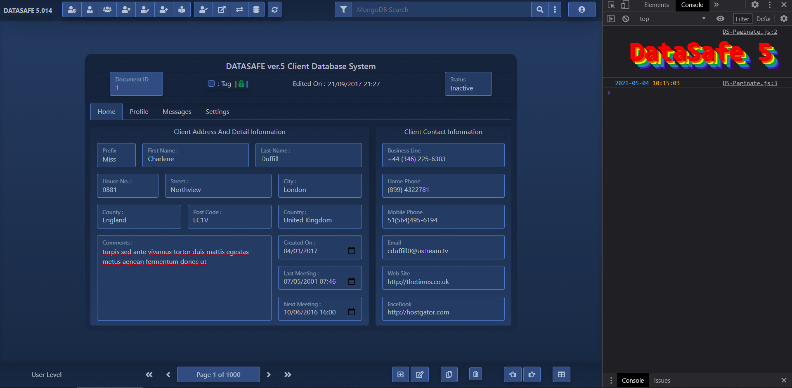

## DS5 - Longterm Project.

# DataSafe5-Alpha - MongoDB Javascript Bootstrap5

*This will be a rewrite of DS4 DataSafe4-Production written in MySQL jQuery Bootstrap4*

Currently : ReadOnly - Active Search Filters - Pagination

Check it out...

[https://avertry.github.io/DS5/](https://avertry.github.io/DS5/)

DS4 version can be seen here - Login: guest@guest.com & Password: Guest

[https://datasafe.tk/](https://datasafe.tk/)
